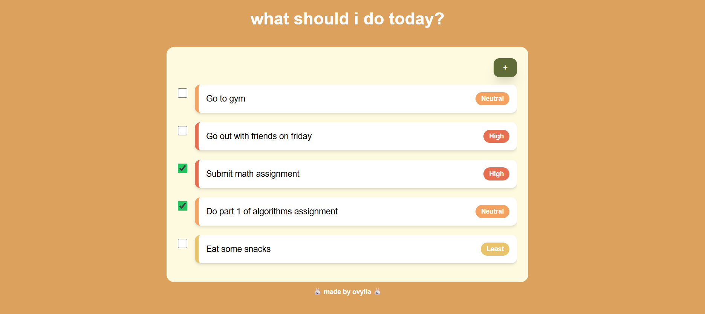

# 📖 To-Do List Website

A simple and cozy to-do list website built using HTML, CSS (tailwind), PHP, and MySQL.
It helps you organise tasks by priority and you can edit and delete however you want!

## 📸 Preview

🎥 [Watch the demo video here~](https://youtu.be/tSQOEdSzOs0)

## ✨ Features

- Add new tasks to your list! You can organise them by priority 📚
- Make any changes to task description and priority level ✍️
- Delete any task you don't wanna see anymore 🫠
- Mark tasks as completed 🥳

## ⚙️ Technical Things

- **Frontend:** HTML, CSS (tailwind), JS
- **Backend:** PHP
- **Database and Server:** MySQL, XAMPP
